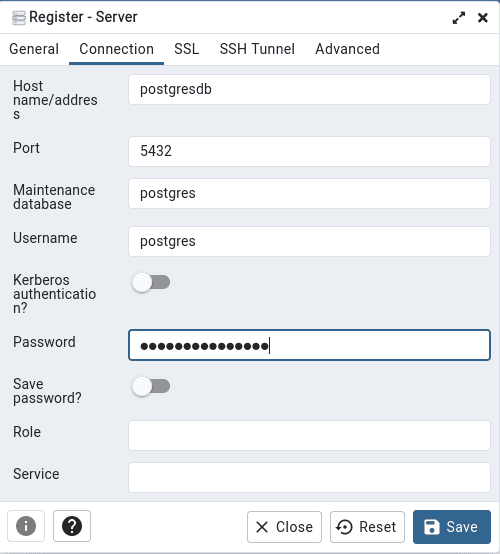

# Official postgresql image inside of docker container

Clone:

``git clone https://github.com/codesshaman/docker_pgadmin4_from_image.git``


Change data:

Change your email address and password in .env befor build for security reasons.

Build:

``make build``

or

``docker-compose up -d --build``

Connect in pgadmin to:

``http://your_host:5432``

Down:

``make down``

or

``docker-compose down``

Up:

``make``

or

``docker-compose up -d``

### Connect from browser:

```
http://127.0.0.1:8432
```

And login with your email/password from .env

### Connect to bd from command line:

```
docker exec -it --user postgres postgresdb psql
```

Connect to database with container name "postgresdb":


